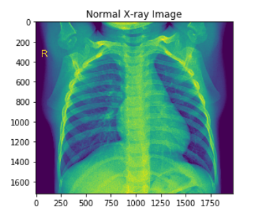
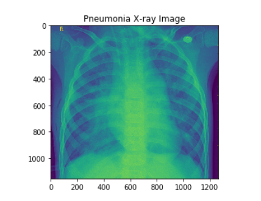
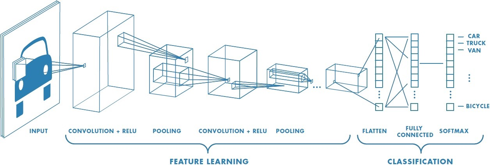

# Machine Learning - Pneumonia-Classification

### Short Description
In this project I tried to classify pneumonia by analysing the x-ray images by using Convolutional Neural Network. Though this is a **binary classification** where 0 represent you do not have pnumonia and 1 represent affirmative I used **softmax activation** function at the last layer and used **categorial_crossentropy** as loss function along with **RMSProp** optimizer.

The whole project was done in **tensorflow 2.0 and keras**. As I finished ["Tensorflow in Practice"](https://www.coursera.org/specializations/tensorflow-in-practice) course from coursera, I tried to implemented what I learned there.

**Accuracy:**
After running for 45 epochs. I have got training accuracy of 95.53% and validation accuracy of 92.95% 

### Data Collection
I got this dataset from [kaggle](https://www.kaggle.com/), This is also probably the dataset which has the most kernels, A lot of people used this dataset to explore data and visualise and also for using CNN architecture.

So, This dataset has Three folder : Train set, Validation Set and Test set. Each of them are consists of two folder NORMAL and PNEUMONIA

Image of Data from Training Set (Normal)

Image of Data from Training Set (Pneumonia)

**Dataset Link: [Chest X-Ray Images (Pneumonia)](https://www.kaggle.com/paultimothymooney/chest-xray-pneumonia)**

### What is CNN ?

**Convolutional Neural Network** is one of a Deep learning architecture that is used for various Image Analysis tasks like image recognition, image classification etc. 
The core two layer of CNN is:

1. Convolutional Layer
2. Pooling Layer

**Convolution Layer:**

Convolutional layer basically extracts the features of given input image. It has done by using a kernel which is can be a 2x2 or 3x3 or any shape of matrix. Then the input image and kernel performs mathematical Calculation which is known as Convolution.

**Pooling Layer:**

Pooling is used when the image is too large and it reduces the number of parameters. there are two kinds of pooling commonly used: a) Max Pooling b) Average Pooling.

To know more here are few link I personally like:

1. https://towardsdatascience.com/a-comprehensive-guide-to-convolutional-neural-networks-the-eli5-way-3bd2b1164a53
2. https://machinelearningmastery.com/convolutional-layers-for-deep-learning-neural-networks/
3. https://medium.com/@RaghavPrabhu/understanding-of-convolutional-neural-network-cnn-deep-learning-99760835f148

**I also wrote a mediam article on [image derivative](https://medium.com/@shafayet.islam.61/understanding-image-derivative-basic-of-computer-vision-77477f919d23), You can look it up. Thank You.**
